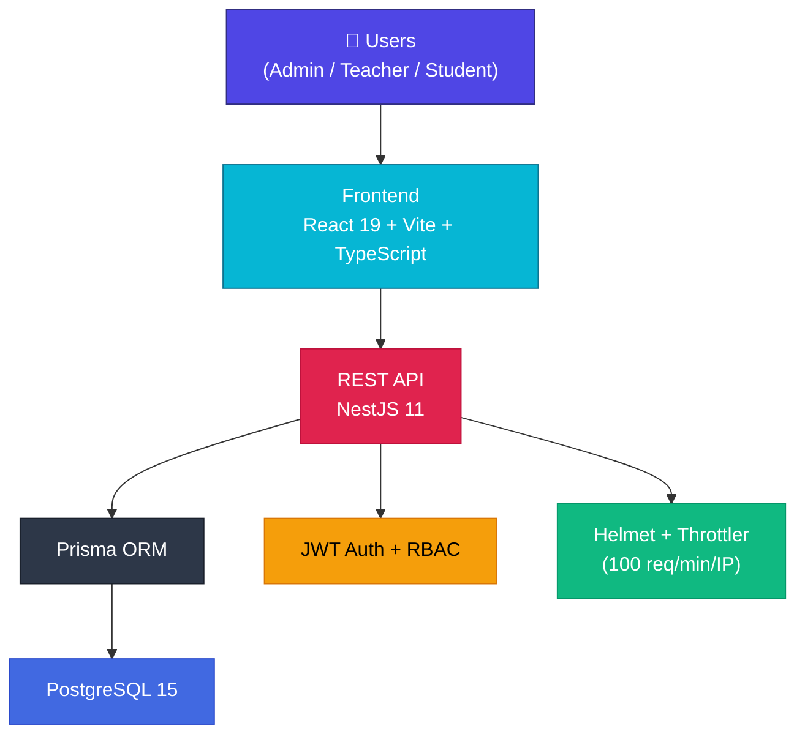
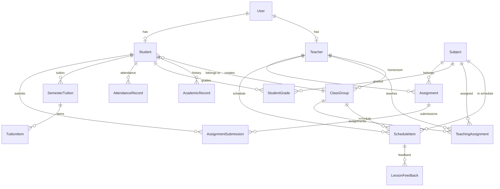

# 🏫 EduSphere — Product Overview

**A comprehensive, modern school management system designed for Vietnamese secondary schools.**

---

## 📋 Table of Contents

- [System Architecture](#-system-architecture)
- [Role-Based Access Control](#-role-based-access-control-rbac)
- [Feature Details](#-feature-details)
  - [Authentication & Security](#1--authentication--security)
  - [Dashboard & Analytics](#2--dashboard--analytics)
  - [Teacher Management](#3--teacher-management)
  - [Student Management](#4--student-management)
  - [Class Management](#5--class-management)
  - [Subject Management](#6--subject-management)
  - [Timetable](#7--timetable)
  - [Grading & Gradebook](#8--grading--gradebook)
  - [Assignments & Homework](#9--assignments--homework)
  - [Tuition Management](#10--tuition-management)
  - [Leaderboard](#11--leaderboard)
  - [Settings & UI Customization](#12--settings--ui-customization)
  - [Import / Export](#13--import--export)
  - [Notifications](#14--notifications)
  - [User Profile](#15--user-profile)
  - [Public Information Portal](#16--public-information-portal)
- [Database Schema](#-database-schema)
- [Backend Architecture](#-backend-architecture-nestjs)
- [Frontend Architecture](#-frontend-architecture-react)
- [Tech Stack Summary](#-tech-stack-summary)
- [Value Proposition](#-value-proposition)

---

## 🏗 System Architecture

| Layer | Technologies | Version |
|-------|-------------|---------|
| **Frontend** | React, Vite, TypeScript, Tailwind CSS, Recharts, Lucide React, ExcelJS, Axios | React 19, Vite 6, TW 4 |
| **Backend** | NestJS, Prisma ORM, Passport JWT, bcryptjs, Helmet, Throttler, class-validator | NestJS 11, Prisma 5 |
| **Database** | PostgreSQL | 15 (Alpine) |
| **DevOps** | Docker Compose, Vercel, GitHub Actions | — |

---

## 🔑 Role-Based Access Control (RBAC)

The system supports **3 user roles** with fine-grained access permissions:

| Page / Feature | 🔴 Admin | 🟢 Teacher | 🔵 Student |
|---------------|:--------:|:----------:|:----------:|
| Dashboard | ✅ | ✅ | ✅ |
| Teacher Management | ✅ Full | 👁 View | ❌ |
| Student Management | ✅ Full | 👁 View | ❌ |
| Class Management | ✅ Full | 👁 View | ❌ |
| Subject Management | ✅ Full | 👁 View | ❌ |
| Timetable | ✅ Edit | ✅ View | ✅ View |
| Teaching Assignments | ✅ | ❌ | ❌ |
| Tuition Management | ✅ | ❌ | ❌ |
| My Classes (Gradebook) | ❌ | ✅ | ❌ |
| Create & Manage Homework | ❌ | ✅ | ❌ |
| Resource Library | ❌ | ✅ | ❌ |
| My Class (Student View) | ❌ | ❌ | ✅ |
| Academic Results | ❌ | ❌ | ✅ |
| Tuition & Services | ❌ | ❌ | ✅ |
| School Rules | ❌ | ❌ | ✅ |
| Leaderboard | ✅ | ✅ | ✅ |
| Notifications | ✅ | ✅ | ✅ |
| Profile | ✅ | ✅ | ✅ |
| Settings (Theme & Language) | ✅ | ✅ | ✅ |

---

## ✨ Feature Details

### 1. 🔐 Authentication & Security

| Feature | Description | Technology |
|---------|-------------|-----------|
| Role-based login | Select Admin/Teacher/Student tab → enter Email + Password | JWT + Passport |
| Password hashing | All passwords hashed before storage | bcryptjs |
| RBAC Guards | Role-checked on every API call | `@Roles()` decorator + `RolesGuard` |
| Rate limiting | 100 requests/minute/IP | `@nestjs/throttler` |
| HTTP header protection | Prevents XSS, clickjacking, MIME sniffing | Helmet |
| Credential reveal | Admin must re-authenticate to view other users' passwords | ReAuthModal |
| Password change | Secure password management modal | PasswordManagementModal |

---

### 2. 📊 Dashboard & Analytics

| Feature | Admin | Teacher | Student |
|---------|:-----:|:-------:|:-------:|
| Overview stats (Total Students, Teachers, Classes) | ✅ | ✅ | ✅ |
| Weekly performance charts | ✅ | ✅ | — |
| Gender distribution chart | ✅ | — | — |
| Enrollment trends (5-10 years) | ✅ | — | — |
| School average GPA | ✅ | ✅ | ✅ |
| Quick leaderboard | ✅ | ✅ | ✅ |
| Next class preview | — | ✅ | ✅ |
| Assignment status | — | — | ✅ |
| Upcoming events | ✅ | ✅ | ✅ |
| Quick actions (Add Teacher/Student) | ✅ | — | — |

> Interactive charts powered by **Recharts** (Bar, Pie, Line, Area).

---

### 3. 👨‍🏫 Teacher Management

| Feature | Description |
|---------|-------------|
| Teacher directory | Search, view detailed profiles |
| CRUD operations | Multi-step form: Account → Personal Info → Expertise |
| Full profile | National ID, address, phone, gender, DOB, join year, subjects |
| Assignment history | View assigned classes, student count |
| Admin notes | Private notes from admin |
| Excel import | Bulk upload via `.xlsx` files |

---

### 4. 👨‍🎓 Student Management

| Feature | Description |
|---------|-------------|
| Student directory | Search, filter by class |
| CRUD operations | Multi-step form: Account → Personal Info → Guardian |
| Full profile | Student ID, DOB, gender, enrollment year, class, GPA, address |
| Guardian information | Name, national ID, birth year, occupation, phone |
| Academic history | GPA by year/class |
| Semester evaluation | Comments from homeroom teacher |
| Admin notes | Private notes |
| Excel import | Bulk upload via `.xlsx` files |
| Auto-generated student IDs | Yearly sequence (e.g., `HS2024001`) |

---

### 5. 🏫 Class Management

| Feature | Description |
|---------|-------------|
| Class list | Name, grade level, room, academic year, homeroom teacher |
| Class statistics | Student count (Male/Female), average GPA, weekly discipline score |
| Weekly score history | Score trend chart (`weeklyScoreHistory`) |
| CRUD operations | Assign homeroom teacher, room, description |

---

### 6. 📚 Subject Management

| Feature | Description |
|---------|-------------|
| Subject directory | Name, code, department, description |
| Analytics | Average GPA per subject, GPA history |
| Teaching faculty | View teachers currently assigned to each subject |
| CRUD operations | Full management forms |

---

### 7. 📅 Timetable

| Feature | Description |
|---------|-------------|
| Dual view modes | View by Class or by Teacher |
| Morning & Afternoon sessions | 5 periods per session |
| Base template + weekly overrides | `weekStartDate = null` → base template; otherwise → specific week |
| Edit mode | Add / edit / remove schedule slots (Admin) |
| Excel/Word export | Export timetable to downloadable files |
| Quick journal access | Direct link to the teaching journal |
| Teaching assignment management | Assign Teacher → Subject → Class with sessions/week |

---

### 8. ✏️ Grading & Gradebook

| Feature | Description |
|---------|-------------|
| Digital gradebook | Input: Oral, 15-min tests (3-5 columns), Midterm, Final |
| Auto-calculated average | Weighted: 1×Oral / 1×15min / 2×Midterm / 3×Final |
| Teaching journal | View lesson history, sign & confirm |
| Lesson evaluation | Rating A–F, comments, digital signature |
| Attendance | Present / Absent / Late / Excused |
| End-of-semester evaluation | Homeroom teacher writes comments for each student |
| Semester & year tracking | `semester: HK1/HK2`, `academicYear` |

---

### 9. 📝 Assignments & Homework

| Feature | Description |
|---------|-------------|
| Create assignments | Title, description, subject, classes, due date, duration |
| Password protection | Optional access code |
| Flexible question format | JSON-based question structure |
| Multi-class distribution | Assign to multiple classes at once |
| Assignment status | ACTIVE / CLOSED / DRAFT |
| Submit answers | Students submit JSON answers |
| Grading | Teachers score + provide feedback |
| Submission status | pending / submitted / late / graded |

---

### 10. 💰 Tuition Management

| Role | Capabilities |
|------|-------------|
| **Admin** | Create fee → Select class → Select students → Enter details (name, amount, due date) → Publish |
| **Student** | View total fees, paid amount, remaining balance. Payment instructions (bank transfer / cash) |

**Data structure:**
- `SemesterTuition`: Grouped by academic year + semester, total amount, status
- `TuitionItem`: Individual fee: name, amount, paid, due date, status (paid/partial/unpaid)

---

### 11. 🏆 Leaderboard

| Feature | Description |
|---------|-------------|
| GPA rankings | School-wide, by grade level, by class |
| Self-position finder | Students can locate their own ranking |

---

### 12. 🎨 Settings & UI Customization

| Feature | Description |
|---------|-------------|
| 4 color themes | Crystal Blue, Sage Green, Dark Plum, Midnight Slate (Dark mode) |
| Bilingual support | Vietnamese 🇻🇳 + English 🇬🇧 (880+ translation keys) |
| Responsive design | Collapsible sidebar, mobile backdrop, hamburger menu |
| Welcome screen | Personalized greeting after login |

---

### 13. 📦 Import / Export

| Feature | Description | Technology |
|---------|-------------|-----------|
| Import teachers from Excel | Upload `.xlsx` → parse → bulk create | `xlsx` (backend) |
| Import students from Excel | Upload `.xlsx` → parse → bulk create | `xlsx` (backend) |
| Download templates | Standard Excel templates | Backend API |
| Export timetable | Export to Excel/Word format | `exceljs` + `file-saver` (frontend) |

---

### 14. 🔔 Notifications

| Feature | Description |
|---------|-------------|
| Notification list | Filter: All / Unread |
| Mark as read | Individual or mark all |
| Delete | Remove individual notifications |
| Types | info / success / warning / alert |

---

### 15. 🧑 User Profile

| Feature | Description |
|---------|-------------|
| View / Edit profile | Name, email, avatar |
| Change password | Secure modal with verification |

---

### 16. 📖 Public Information Portal

| Feature | Description |
|---------|-------------|
| School introduction | History, achievements (no login required) |
| Contact info | Address, hotline, email, Google Maps |
| Developer credits | Version, technology stack |

---

## 🗄 Database Schema

The system uses **16 Prisma models** backed by PostgreSQL:

<b>📋 Click to expand full model details</b>

| Model | Description | Key Fields |
|-------|-------------|-----------|
| `User` | User accounts (auth & role) | username, password, email, role (ADMIN/TEACHER/STUDENT) |
| `Teacher` | Teacher profiles | National ID, phone, subjects[], department, join year |
| `Student` | Student profiles + guardian info | DOB, class, GPA, guardian (name, ID, job, phone), evaluation |
| `ClassGroup` | Class groups with statistics | name, grade level, room, homeroom teacher, GPA, weekly score |
| `Subject` | Curriculum subjects | name, code, department, description |
| `ScheduleItem` | Timetable entries | day, period, session, room, subject, class, teacher, week override |
| `TeachingAssignment` | Teacher-Subject-Class mapping | teacher, subject, class, sessions per week |
| `AcademicRecord` | Student academic history | year, className, GPA |
| `StudentGrade` | Detailed grades per subject | oral, 15-min scores[], midterm, final, average, semester |
| `AttendanceRecord` | Attendance tracking | student, date, status (present/absent/late/excused) |
| `SemesterTuition` | Semester fee summaries | student, academic year, semester, total, paid, status |
| `TuitionItem` | Individual fee items | name, amount, paid, due date, status (paid/partial/unpaid) |
| `Assignment` | Homework & tests | title, subject, teacher, classes, questions (JSON), password |
| `AssignmentSubmission` | Student submissions | student, answers (JSON), score, feedback, status |
| `LessonFeedback` | Lesson evaluations | schedule, date, rating (A-F), comment, digital signature |
| `IdSequence` | Auto-increment counters | key (e.g. "STUDENT_2024"), value |

---

## ⚙️ Backend Architecture (NestJS)

The backend is organized into **15 modular NestJS modules**:

| Module | Responsibility |
|--------|---------------|
| `AuthModule` | Login, JWT strategy, role-based guards |
| `UsersModule` | CRUD for user accounts |
| `StudentsModule` | CRUD + guardian relationships |
| `TeachersModule` | CRUD for teacher profiles |
| `ClassesModule` | CRUD + statistics aggregation |
| `SubjectsModule` | CRUD for subjects |
| `GradesModule` | Grade management per student/subject/semester |
| `ScheduleModule` | Schedule management (base + weekly overrides) |
| `TimetableModule` | Aggregated timetable APIs |
| `TeachingAssignmentsModule` | Teacher-Subject-Class assignments |
| `AssignmentsModule` | Homework + submissions |
| `LessonFeedbackModule` | Lesson evaluation + digital signatures |
| `ImportsModule` | Bulk import from Excel |
| `CommonModule` | Dashboard stats, shared utilities |
| `PrismaModule` | Prisma Client singleton |

---

## 🎨 Frontend Architecture (React)

### Pages (21 total)

| Page | Purpose | Access |
|------|---------|--------|
| `Login` | Role-based authentication | Public |
| `Welcome` | Post-login greeting screen | All |
| `Dashboard` | Analytics & overview | All (role-adapted) |
| `Teachers` | Teacher management | Admin, Teacher |
| `Students` | Student management | Admin, Teacher |
| `Classes` | Class management | Admin, Teacher |
| `Subjects` | Subject management | Admin, Teacher |
| `Timetable` | Schedule viewer & editor | All |
| `TeachingAssignments` | Assign teachers to classes | Admin |
| `AdminTuition` | Create & manage fees | Admin |
| `MyClasses` | Gradebook, journal, evaluations | Teacher |
| `TeacherAssignments` | Create & manage homework | Teacher |
| `TeacherResources` | Resource library | Teacher |
| `StudentClass` | Student's class info | Student |
| `StudentResults` | Academic results viewer | Student |
| `Tuition` | Fee & payment info | Student |
| `Rules` | School rules | Student |
| `Leaderboard` | GPA rankings | All |
| `Notifications` | Notification center | All |
| `Profile` | User profile editor | All |
| `Settings` | Theme & language settings | All |

### Shared Components (9 total)

| Component | Purpose |
|-----------|---------|
| `Sidebar` | Navigation (expandable/collapsible, responsive) |
| `Header` | Page title, avatar, quick notifications |
| `ExcelImportModal` | Excel upload with preview |
| `CredentialRevealModal` | Show credentials after re-authentication |
| `PasswordManagementModal` | Password change modal |
| `ReAuthModal` | Admin re-authentication prompt |
| `ErrorBoundary` | React runtime error catching |
| `DateInput` | Standardized date input component |
| `SchoolLogo` | School logo display |

### Context Providers

| Context | Purpose |
|---------|---------|
| `LanguageContext` | Bilingual i18n (Vietnamese/English) |
| `ThemeContext` | 4 color themes with live switching |
| `ToastContext` | Toast notification system |
| `ConfirmContext` | Confirmation dialogs |

---

## 🛠 Tech Stack Summary

| Category | Technology | Role |
|----------|-----------|------|
| **UI Framework** | React 19 | Single Page Application |
| **Build Tool** | Vite 6 | Dev server + production bundling |
| **Language** | TypeScript 5.8 | Type safety across full stack |
| **CSS Framework** | Tailwind CSS v4 | Utility-first responsive styling |
| **Charts** | Recharts 3.6 | Interactive data visualization |
| **Icons** | Lucide React | Modern SVG icon library |
| **HTTP Client** | Axios 1.13 | API communication |
| **Excel (Frontend)** | ExcelJS + file-saver | Timetable export |
| **Excel (Backend)** | xlsx 0.18 | Bulk data import |
| **API Framework** | NestJS 11 | Modular REST API |
| **ORM** | Prisma 5 | Database access + migrations |
| **Database** | PostgreSQL 15 | Relational data store |
| **Authentication** | Passport + JWT | Token-based auth |
| **Security** | bcryptjs, Helmet | Password hashing + HTTP hardening |
| **Rate Limiting** | @nestjs/throttler | DDoS protection |
| **Validation** | class-validator + class-transformer | DTO validation pipeline |
| **Containerization** | Docker Compose | Local development environment |
| **Deployment** | Vercel | Production hosting |
| **i18n** | Custom LanguageContext | Vietnamese + English (880+ keys) |
| **Theming** | Custom ThemeContext | 4 switchable color themes |

---

## 💎 Value Proposition

### 🔴 For School Administrators
- **Centralized management** of all teachers, students, classes, and subjects
- **Bulk operations** via Excel import — saves hours of manual data entry
- **Flexible teaching assignments** — Teacher ↔ Subject ↔ Class mapping
- **Professional tuition management** — create fees → assign → track payments
- **Data-driven decisions** with interactive analytics dashboard
- **Enterprise-grade security** with RBAC, rate limiting, and encrypted passwords

### 🟢 For Teachers
- **Digital gradebook** — enter grades online, auto-calculated averages
- **Teaching journal** — track lessons taught, sign & confirm with digital signatures
- **Quick attendance** — mark all students in one view
- **Semester evaluations** — write comprehensive comments for homeroom students
- **Assignment creation** — flexible question formats, track submissions
- **Resource library** — organize and share teaching materials by class/subject

### 🔵 For Students
- **Personalized timetable** — view your weekly schedule
- **Track academic results** — grades by subject and semester
- **View tuition details** — fees, payment status, and payment instructions
- **Academic leaderboard** — compare GPA rankings with peers
- **Submit homework online** — digital assignment submissions
- **School rules reference** — always accessible

### 🌐 For Visitors (No Login Required)
- **School information** — history, achievements, and awards
- **Contact details** — address, hotline, email, Google Maps
- **Developer credits** — technology stack and version info

---

**Built with ❤️ for Vietnamese education**

*© 2026 EduSphere Ecosystem — Powered by modern web technologies*

