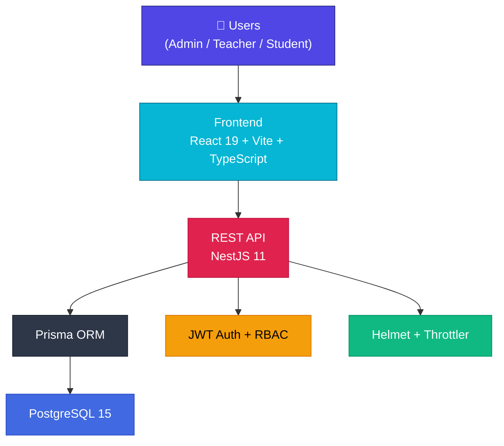

<div align="center">

  <h1>🏫 EduSphere — Student Management System</h1>
  <p>
    A modern, high-performance, and secure system for managing students, teachers, and school operations.
  </p>

  
  
  
  
  
  
  

  <br />

  <a href="./PRODUCT_REVIEW.md"><strong>📖 Full Product Review »</strong></a>
  <br />
  <br />
  <a href="#">View Demo</a>
  ·
  <a href="https://github.com/your-username/NewEduSystem/issues">Report Bug</a>
  ·
  <a href="https://github.com/your-username/NewEduSystem/issues">Request Feature</a>

</div>

---

<!-- ABOUT THE PROJECT -->
## 📝 About The Project

**EduSphere** (formerly NewEduSystem) is a comprehensive web application designed to streamline and centralize the management of educational institutions. It provides dedicated interfaces for **Admins**, **Teachers**, and **Students**, with full Role-Based Access Control (RBAC).

Built with a robust tech stack, the system ensures high scalability, top-tier security, and an excellent user experience.

> 📖 **Want the full picture?** Check out the [**Product Review**](./PRODUCT_REVIEW.md) for a deep dive into every feature, database schema, architecture diagrams, and more.

---

## 🚀 Key Features

### 🔐 Authentication & Security
- **JWT-based authentication** with role selection (Admin / Teacher / Student)
- **bcryptjs** password hashing — passwords are never stored in plaintext
- **RBAC Guards** — every API endpoint is role-protected
- **Rate limiting** — 100 requests/minute/IP via `@nestjs/throttler`
- **Helmet** protection against XSS, clickjacking, and MIME sniffing
- **Re-authentication** required for admins to view other users' credentials

### 👥 User Management
- Full CRUD for **Teachers** and **Students** with multi-step forms
- **Bulk import from Excel** — upload `.xlsx` to create hundreds of records  
- **Auto-generated student IDs** — yearly sequences (e.g., `HS2024001`)
- Detailed profiles: personal info, guardian info, academic history, admin notes

### 📅 Advanced Timetable
- **Dual view modes**: view by Class or by Teacher
- **Base template + weekly overrides** — flexible scheduling system
- **Admin edit mode** — drag-and-drop style slot management
- **Export to Excel/Word** for printing or offline use
- **Teaching assignment management** — assign Teacher ↔ Subject ↔ Class

### ✏️ Grading & Academic Tools
- **Digital gradebook** — Oral, 15-min, Midterm, Final scores with auto-calculated averages
- **Teaching journal** — track lessons, sign & confirm with digital signatures
- **Attendance tracking** — Present / Absent / Late / Excused
- **Semester evaluations** — homeroom teachers write student assessments
- **Academic leaderboard** — GPA rankings by school, grade, or class

### 📝 Assignments & Homework
- Create assignments with **flexible JSON question formats**
- Optional **password protection** for exams
- Multi-class distribution, **submission tracking**, and teacher grading

### 💰 Tuition Management
- **Admin**: create fees → assign to students → track payment status
- **Students**: view fees, payment instructions (bank transfer / cash)

### 📊 Analytics Dashboard
- Role-adapted dashboard with **interactive Recharts visualizations**
- Stats: student/teacher counts, GPA trends, gender distribution, enrollment history
- Quick actions, upcoming events, and next-class preview

### 🎨 Customization
- **4 color themes**: Crystal Blue, Sage Green, Dark Plum, Midnight Slate (Dark)
- **Bilingual**: Vietnamese 🇻🇳 + English 🇬🇧 (880+ translation keys)
- **Fully responsive** — optimized for desktop, tablet, and mobile

---

## 🛠 Built With

<table>
  <tr>
    <td align="center"><b>Frontend</b></td>
    <td align="center"><b>Backend</b></td>
    <td align="center"><b>Database</b></td>
    <td align="center"><b>DevOps</b></td>
  </tr>
  <tr>
    <td>
      <br/>
      <br/>
      <br/>
      
    </td>
    <td>
      <br/>
      <br/>
      <br/>
      
    </td>
    <td>
      
    </td>
    <td>
      <br/>
      
    </td>
  </tr>
</table>

---

## 🏗 Architecture Overview



---

## 🔑 Role-Based Access

| Feature | 🔴 Admin | 🟢 Teacher | 🔵 Student |
|---------|:--------:|:----------:|:----------:|
| Dashboard & Analytics | ✅ | ✅ | ✅ |
| Manage Teachers / Students / Classes | ✅ Full | 👁 View | ❌ |
| Timetable | ✅ Edit | ✅ View | ✅ View |
| Gradebook & Journal | ❌ | ✅ | ❌ |
| Assignments & Homework | ❌ | ✅ Create | ✅ Submit |
| Tuition Management | ✅ | ❌ | ✅ View |
| Leaderboard | ✅ | ✅ | ✅ |
| Settings & Profile | ✅ | ✅ | ✅ |

> 📋 See the [full access control matrix](./PRODUCT_REVIEW.md#-role-based-access-control-rbac) in the Product Review.

---

<!-- GETTING STARTED -->
## ⚙️ Getting Started

Follow these instructions to set up the project locally.

### Prerequisites

*   [Node.js](https://nodejs.org/) v18 or higher
*   [PostgreSQL](https://www.postgresql.org/) running locally or via Docker
*   `npm` package manager

### Quick Start with Docker

```sh
# Start PostgreSQL
docker-compose up -d
```

### Installation

1.  **Clone the repo**
    ```sh
    git clone https://github.com/your-username/NewEduSystem.git
    cd NewEduSystem
    ```

2.  **Setup the Backend**
    ```sh
    cd backend
    npm install
    cp .env.example .env    # Update with your PostgreSQL credentials
    npx prisma generate
    npx prisma db push
    npx prisma db seed      # (Optional) Seed sample data
    npm run start:dev
    ```

3.  **Setup the Frontend**
    ```sh
    # In a new terminal
    cd frontend
    npm install
    cp .env.example .env
    npm run dev
    ```

4.  **Open in browser**
    ```
    http://localhost:5173
    ```

---

## 📁 Project Structure

```
NewEduSystem/
├── backend/                # NestJS API server
│   ├── src/
│   │   ├── auth/           # JWT authentication & RBAC guards
│   │   ├── users/          # User account management
│   │   ├── students/       # Student CRUD + guardian info
│   │   ├── teachers/       # Teacher CRUD
│   │   ├── classes/        # Class management + stats
│   │   ├── subjects/       # Subject management
│   │   ├── grades/         # Grade management
│   │   ├── schedule/       # Timetable scheduling
│   │   ├── timetable/      # Aggregated timetable APIs
│   │   ├── assignments/    # Homework & submissions
│   │   ├── teaching-assignments/  # Teacher-Subject-Class mapping
│   │   ├── lesson-feedback/      # Lesson evaluation & signatures
│   │   ├── imports/        # Excel bulk import
│   │   ├── common/         # Dashboard stats & shared utils
│   │   └── prisma/         # Prisma client module
│   └── prisma/
│       ├── schema.prisma   # Database schema (16 models)
│       └── seed.ts         # Sample data seeder
├── frontend/               # React SPA
│   ├── pages/              # 21 page components
│   ├── components/         # 9 shared UI components
│   ├── contexts/           # Theme, Language, Toast, Confirm
│   ├── locales.ts          # i18n translations (880+ keys)
│   ├── types.ts            # TypeScript interfaces
│   └── App.tsx             # Main app with routing & layout
├── docker-compose.yml      # PostgreSQL container setup
└── PRODUCT_REVIEW.md       # Full product documentation
```

---

<!-- CONTRIBUTING -->
## 🤝 Contributing

Contributions are what make the open-source community such an amazing place to learn, inspire, and create. Any contributions you make are **greatly appreciated**.

1. Fork the Project
2. Create your Feature Branch (`git checkout -b feature/AmazingFeature`)
3. Commit your Changes (`git commit -m 'Add some AmazingFeature'`)
4. Push to the Branch (`git push origin feature/AmazingFeature`)
5. Open a Pull Request

---

## 📄 License

Distributed under the MIT License. See [`LICENSE`](./LICENSE) for more information.

---

## ✉️ Contact

Project Link: [https://github.com/your-username/NewEduSystem](https://github.com/your-username/NewEduSystem)

---

<div align="center">

**Built with ❤️ for Vietnamese education**

*© 2026 EduSphere Ecosystem*

</div>
